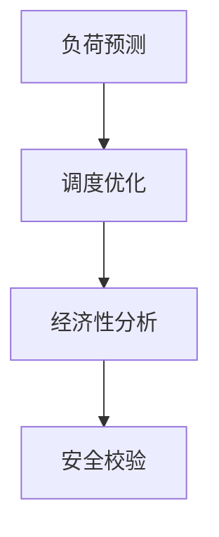

智能电站项目的详细设计方案：

### 一、系统架构设计（整体采用分层架构）


1. **设备接口层**：物理设备通信模块
2. **数据采集层**：实时数据采集与预处理
3. **核心算法层**：电力调度与优化算法
4. **服务接口层**：API与可视化服务
5. **管理控制层**：系统监控与配置管理

### 二、模块分解与关键技术
#### 1. 设备接口模块
```python
# 参考网页4的模块化设计
class DeviceConnector:
    def __init__(self, protocol='MODBUS'):
        self.protocol = protocol
        
    def read_sensor(self, device_id):
        """实现设备状态读取"""
        # 使用PyModbus库实现协议通信
        pass
        
    def send_control(self, device_id, command):
        """发送控制指令"""
        # 集成异常重试机制
        pass
```
• 采用适配器模式支持多种工业协议（MODBUS/OPC UA）
• 集成异常重试和连接池管理

#### 2. 数据管道模块
| 组件        | 技术选型       | 数据流频率 |
|------------|---------------|-----------|
| 实时采集    | Kafka+Spark   | 100ms/次  |
| 历史存储    | TimescaleDB   | 每日归档  |
| 异常检测    | PyTorch LSTM  | 实时流处理 |

参考网页2的数据处理架构，采用：
• Apache Kafka作为消息中间件
• TimescaleDB存储时序数据
• 集成PyTorch实现异常预测

#### 3. 核心算法模块

• 实现混合整数规划模型（PuLP库）
• 集成遗传算法优化调度方案
• 参考网页1的模块化设计原则，每个算法独立封装

#### 4. API服务模块
采用FastAPI构建RESTful接口，参考网页2的现代API设计：
```python
@app.post("/api/v1/schedule")
async def create_schedule(schedule: ScheduleSchema):
    """电力调度接口"""
    # 集成JWT认证
    # 支持异步任务处理
    return {"task_id": task_id}
```
• 接口文档自动生成（OpenAPI 3.0）
• 集成Celery实现异步任务队列

### 三、项目结构设计
参考网页3的目录规范：
```
create-your-own-x/
├── voltforge/
│   ├── src/
│   │   ├── core/              # 核心算法
│   │   ├── device_io/         # 设备接口
│   │   ├── data_pipeline/     # 数据管道
│   │   └── web_api/          # 服务接口
│   ├── tests/
│   │   ├── unit/              # 单元测试
│   │   └── integration/      # 集成测试
│   ├── config/
│   │   └── settings.toml     # 统一配置
│   └── docs/
│       └── architecture.md   # 架构文档
├── common/                   # 公共模块
│   ├── utils/                # 工具类
│   └── models/               # 数据模型
└── templates/                # 项目模板
```
关键配置分离设计参考网页4，采用TOML格式配置文件实现环境隔离

### 四、技术栈选型
| 领域         | 技术组件                  | 版本   | 作用                 |
|--------------|--------------------------|--------|----------------------|
| 通信协议     | PyModbus/opcua-python    | 3.0+   | 工业设备交互         |
| 数据处理     | Pandas+NumPy             | 1.5+   | 数据清洗与分析       |
| 机器学习     | PyTorch+Sklearn          | 2.0+   | 预测模型构建         |
| 任务队列     | Celery+Redis             | 5.3+   | 异步任务处理         |
| API服务      | FastAPI+Uvicorn          | 0.85+  | 接口服务             |
参考网页2的架构体系，形成完整技术生态

### 五、扩展性设计
1. **插件机制**：通过装饰器实现功能扩展
   ```python
   @register_plugin
   class NewAlgorithm:
       def execute(self, data):
           # 新算法实现
   ```
2. **配置热加载**：采用watchdog监控配置文件变更
3. **模块化部署**：支持Docker独立组件部署

### 六、质量保障体系
1. 自动化测试：pytest+Allure生成测试报告
2. 代码检查：flake8+black统一代码风格
3. CI/CD：GitHub Actions实现自动部署
4. 监控告警：Prometheus+Grafana监控面板

项目初期先构建核心算法模块与设备通信层，逐步扩展其他组件。
